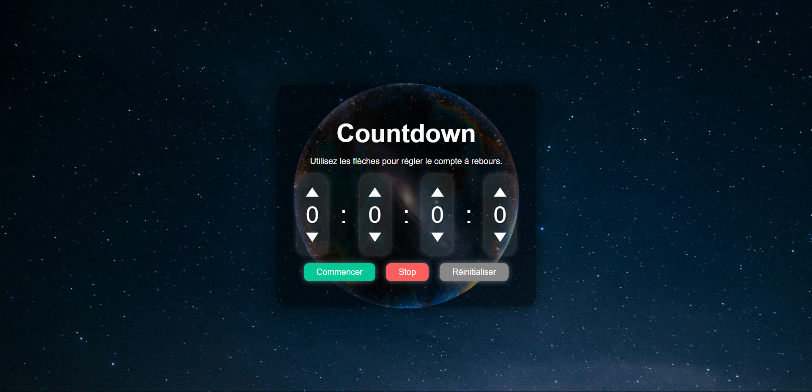

# Countdown

Un petit projet de **compte à rebours** simple et efficace, réalisé avec HTML, CSS et JavaScript.

## Fonctionnalités

- Sélection du temps de départ (heures, minutes, secondes) via des flèches interactives
- Affichage dynamique du temps restant
- Boutons pour démarrer, arrêter et réinitialiser le compte à rebours
- Message affiché à la fin du compte à rebours
- Interface responsive et moderne grâce à Bootstrap

## Structure du projet

```
scripts/
    index.js
styles/
    index.css
    images/
        background.jpg
        rendu_countdown.png
index.html
README.md
```

## Technologies utilisées

- HTML5 / CSS3
- JavaScript
- Bootstrap 5

## Utilisation

1. Ouvre `index.html` dans ton navigateur.
2. Utilise les flèches pour régler le temps souhaité.
3. Clique sur **Commencer** pour lancer le compte à rebours.
4. Utilise **Stop** pour mettre en pause et **Réinitialiser** pour remettre à zéro.

## Installation

Clone le dépôt puis ouvre le fichier `index.html` :

```bash
git clone https://github.com/votre-utilisateur/countdown.git
cd countdown
```

## Capture d'écran



---

### Des améliorations sont en cours de développement....